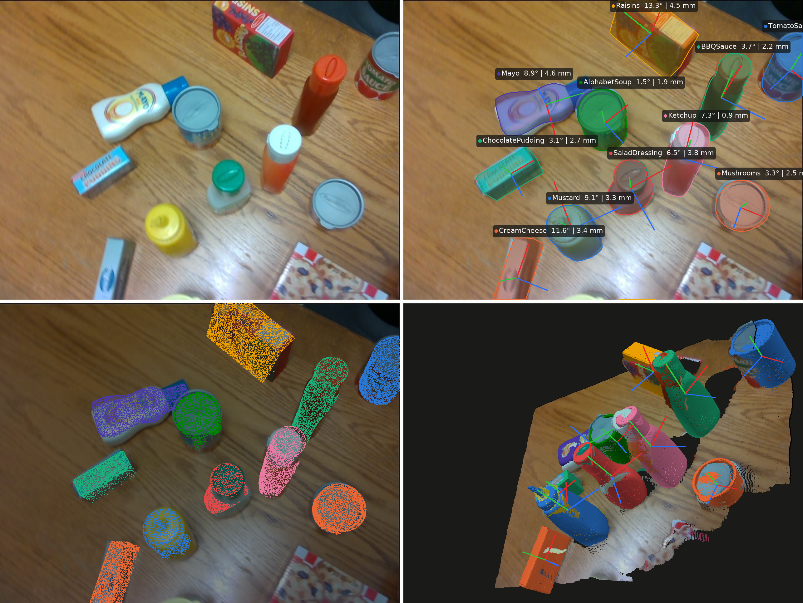
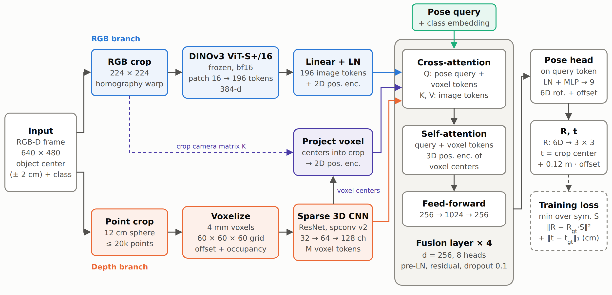
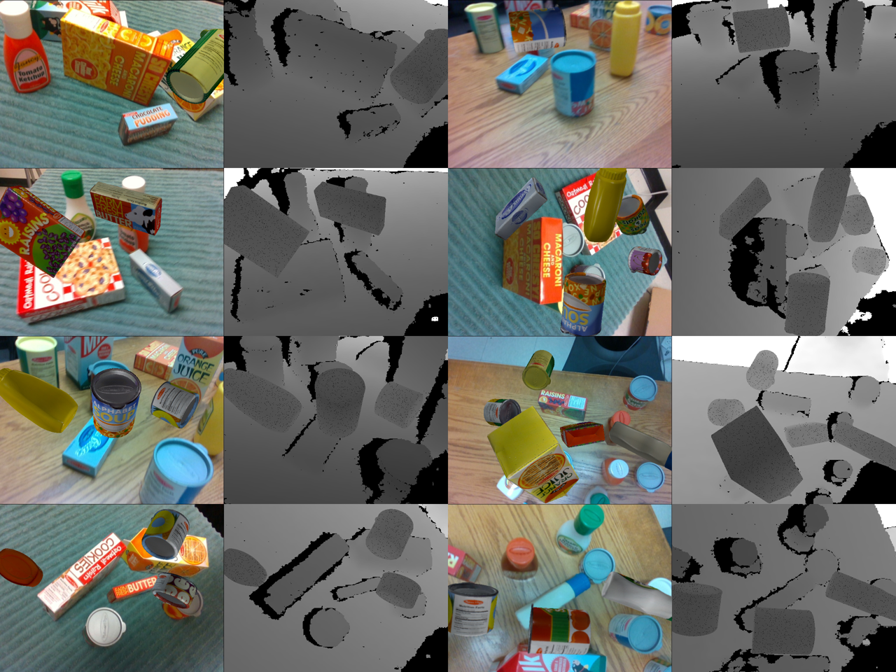
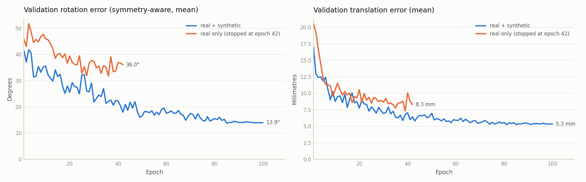
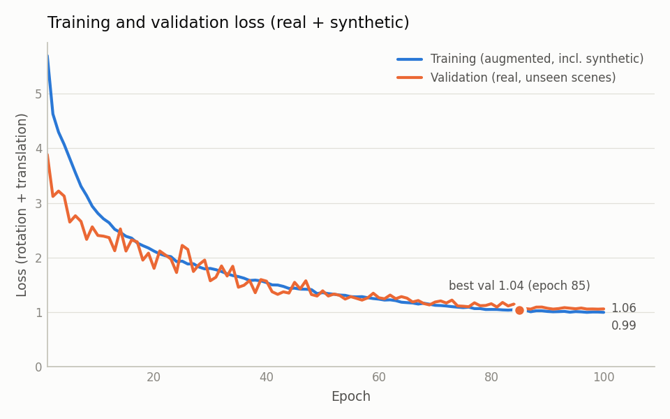
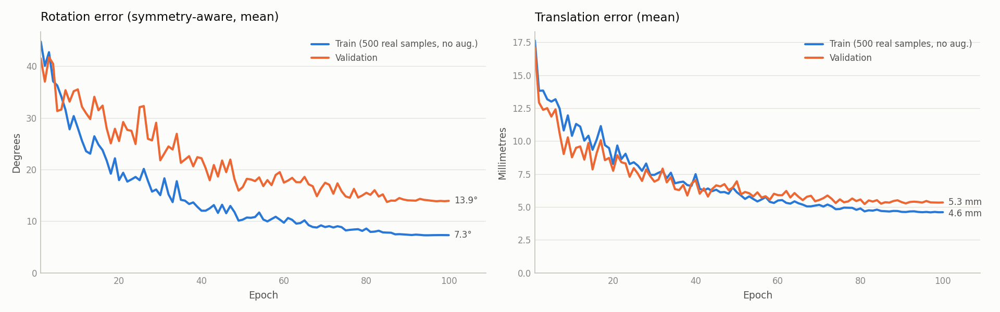
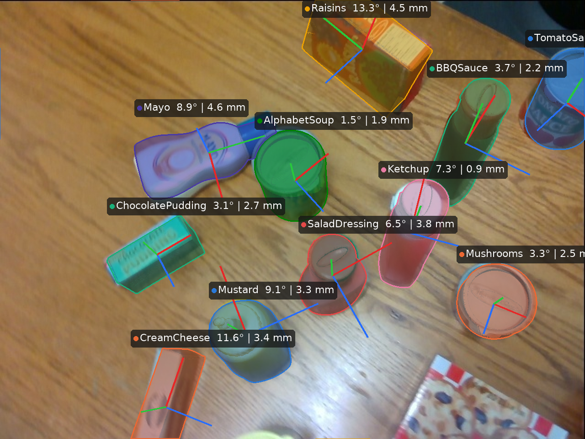
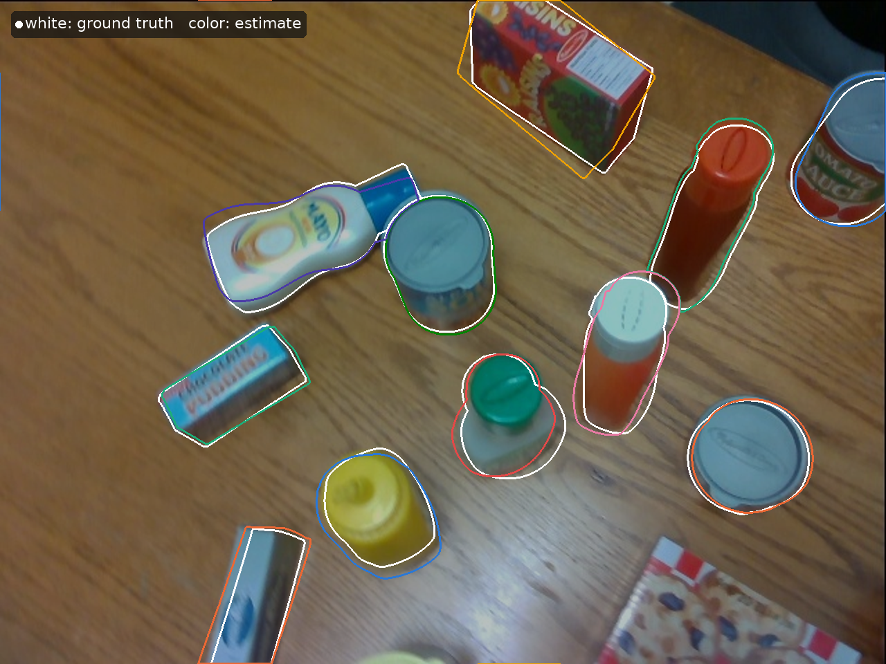

# CrossHOPE: Multi-Modal RGB-D Cross-Attention Fusion Network for 6D Object Pose Estimation Targeting Physical AI Applications

A compact RGB-D network that estimates the full 6D pose (3D rotation + 3D translation) of known household
objects. A frozen **DINOv3** vision transformer reads the color image, a **sparse 3D CNN (spconv v2)** reads
the depth as voxels, and **geometry-aware cross-attention** fuses the two before a pose head predicts the
rotation and translation of each object.

This is version 1 of the project. Its goal was to **validate the architecture** on a public benchmark
([HOPE-Video](https://github.com/swtyree/hope-dataset)) before building version 2 for **bin picking** with a
**spatio-temporal** model.


*Validation frame never seen in training (HOPE-Video scene 0003, frame 0017). Top: input and estimated poses
(3D models rendered as translucent masks, axes X red / Y green / Z blue). Bottom: model surface points at the
estimated pose, and a 3D view of the measured point cloud with the estimated models.*

## Results at a glance

Validation on 3 unseen HOPE-Video scenes (1,725 object instances, 11 object classes):

| | Real data only | Real + synthetic data |
|---|---|---|
| Rotation error, mean / median (symmetry-aware) | 31.7° / 20.3° | **13.7° / 7.5°** |
| Translation error, mean / median | 8.5 mm / 7.7 mm | **5.3 mm / 4.8 mm** |
| Accuracy (rotation < 10° **and** translation < 10 mm) | 21.3 % | **60.0 %** |
| Fully visible objects only: rotation mean / median, accuracy | – | 12.0° / 6.7°, 66.0 % |
| Network time per frame with 8 objects (RTX 4090) | same network | 35 ms |

The single change between the two columns is **synthetic training data rendered from the objects' own 3D
models** (no external data). It cut the rotation error by more than half and closed most of the gap between
training and validation error (a same-epoch comparison is in [5.1](#51-effect-of-synthetic-data)).

---

## Contents
1. [Method](#1-method)
2. [Data and preprocessing](#2-data-and-preprocessing)
3. [Synthetic data](#3-synthetic-data)
4. [Training setup and parameters](#4-training-setup-and-parameters)
5. [Results](#5-results)
6. [Speed and real-time suitability](#6-speed-and-real-time-suitability)
7. [Getting started](#7-getting-started)
8. [Repository structure](#8-repository-structure)
9. [Limitations and roadmap](#9-limitations-and-roadmap-v2)
10. [Acknowledgements, citations and licenses](#10-acknowledgements-citations-and-licenses)

---

## 1. Method

The network works **per object**. For each object in a frame, a region around its (approximate) 3D center is
cut out of the RGB image and the depth map, and the network regresses the object's pose (rotation R and
translation t) in the camera frame.


*Architecture. Blue: RGB branch, orange: depth branch, purple: the geometric link that projects every voxel
into the RGB crop, green: the pose query. Four fusion layers combine the branches; the pose head reads the
pose query token.*

### 1.1 Data flow, step by step

1. **Input.** An RGB-D frame (640 × 480), an approximate 3D center of the object and its class. The
    center is the ground-truth center plus up to ±2 cm of noise per axis (a stand-in for a detector).
2. **Object crop.** A sphere of radius 12 cm around the center defines the object region.
    - *RGB:* the square that encloses the projected sphere is warped to **224 × 224** with a homography and
      normalized with ImageNet statistics. The crop's own camera matrix `K_crop` is kept.
    - *Depth:* the depth pixels in that window become 3D points; points inside the sphere are kept
      (at most **20,000**) and expressed relative to the center.
3. **RGB branch.** **DINOv3 ViT-S+/16** (29 M parameters, frozen, bf16) turns the crop into
    14 × 14 = **196 patch tokens** of 384 dimensions → Linear + LayerNorm → **196 × 256** image tokens.
    Each image token gets a 2D positional encoding (a small MLP) of its patch position (u, v) in the crop.
4. **Depth branch.** The points are binned into **4 mm voxels** on a 60 × 60 × 60 grid; each occupied voxel
    stores the mean point offset (divided by the radius) and an occupancy flag (4 values). A **sparse 3D CNN**
    (ResNet blocks, spconv v2; 32 → 64 → 128 channels, two stride-2 stages) processes only the occupied voxels
    and outputs one token per occupied stride-4 voxel → Linear + LayerNorm → **M × 256** voxel tokens
    (M varies per object, at most 15³).
5. **Geometric link (the key step).** The 3D center of every voxel token is projected into the RGB crop with
    `K_crop`, and the resulting (u, v) goes through **the same** 2D positional-encoding MLP as the image
    tokens. A voxel and the image patch it lies on therefore share the same position code, so in
    cross-attention each voxel naturally looks at its own pixels: RGB and depth are aligned by camera
    geometry instead of being matched blindly.
6. **Fusion, repeated 4 times** (width 256, 8 heads, pre-LayerNorm, residual connections, dropout 0.1).
    The token sequence is [**pose query** (a learned vector + the class embedding); **voxel tokens**].
    - *Cross-attention:* queries = these tokens + their 2D position code; keys/values = the 196 image tokens
      (+ their 2D position code). Each voxel collects color and texture evidence from its image region.
    - *Self-attention:* the pose query and the voxel tokens exchange information, with a 3D positional
      encoding of the voxel centers (padding masked). The pose query gathers evidence from the whole object.
    - *Feed-forward:* 256 → 1024 → 256.
7. **Pose head.** From the final pose-query token: LayerNorm + MLP → 9 numbers.
    - 6 numbers form the **6D rotation representation** (Zhou et al., 2019), turned into a valid rotation
      matrix R by Gram–Schmidt orthonormalization.
    - 3 numbers are a translation offset: **t = crop center + 0.12 m × offset**, so the network only has to
      correct the (up to ±2 cm) error of the crop center.
8. **Loss (training only, always ≥ 0):**

    `L = min_S ‖R − R_gt·S‖²_F  +  ‖t − t_gt‖₁ [cm]`

    where `S` runs over the object's symmetry group (see [2.4](#24-object-symmetries)), so a pose that is
    correct up to a symmetry of the object is not penalized.

**Size.** ≈ 6.9 M trainable parameters; the 29 M parameters of DINOv3 stay frozen.

**Alternative head.** A *dense* head (every voxel predicts its object coordinate, then a weighted Kabsch fit)
is implemented (`pose_head = "dense"`) but was not used for the reported results.

## 2. Data and preprocessing

### 2.1 Dataset
[HOPE-Video](https://github.com/swtyree/hope-dataset): 10 RGB-D sequences (2,038 frames, RealSense D415,
640 × 480) of 28 toy grocery objects with 6D pose labels and textured 3D models. In each sequence the objects
are static and the camera moves.

| Split | Scenes | Object instances |
|---|---|---|
| Train | `hope_video_scene_0000, 0001, 0002, 0004, 0005, 0007, 0009` | 11,575 real (+ synthetic, see [3](#3-synthetic-data)) |
| Validation | `hope_video_scene_0003, 0006, 0008` | 1,725 |

23 object classes appear in the training scenes. Validation objects of classes never seen in training
(GranolaBars, Tuna) are excluded. `hope_image_valid` / `hope_image_test` (1080p, different setup) were not used.

### 2.2 Units and normalization
- Depth PNG (uint16, mm) → meters; pose translation in the labels (cm) → meters.
- The network never sees absolute depth values: points are expressed relative to the crop center and divided
  by the crop radius, and RGB is normalized with ImageNet mean/std.

### 2.3 Per-scene depth correction
Rendering each object's 3D model at its labeled pose and comparing it with the measured depth
(`mesh_tools.py audit`) revealed a **systematic depth offset per scene** of −1.25 % to −4.6 % (about 6–18 mm):
the measured surfaces were consistently closer than the labels. A per-scene scale factor
(`depth_corrections.json`) makes the depth consistent with the labels; it is applied when loading the data.

### 2.4 Object symmetries
Many objects look the same after certain rotations (a can around its axis, a box after a 180° flip). Without
handling this, the network is penalized for correct predictions — for example, boxes were often predicted
flipped by 180° (Butter: median error 177°). Symmetries are **detected automatically from the 3D models**
(`mesh_tools.py symmetry`): the model is rotated, and the rotation counts as a symmetry if the rotated surface
matches the original within 3× the surface-sampling noise.

| Type | Objects |
|---|---|
| Continuous around Y + 180° flips | cans: AlphabetSoup, Cherries, Corn, GreenBeans, Mushrooms, Parmesan, Peaches, PeasAndCarrots, Pineapple, TomatoSauce, Tuna (Yogurt: continuous Y + 180° Y) |
| 180° about X, Y and Z | boxes: Butter, ChocolatePudding, Cookies, CreamCheese, GranolaBars, MacaroniAndCheese, Popcorn, Raisins, Spaghetti |
| 180° about Y | bottles and cartons: BBQSauce, Ketchup, Mayo, Milk, Mustard, OrangeJuice, SaladDressing |

Symmetries are purely geometric (texture is ignored), which is what matters for grasping. The loss and the
reported rotation error use the closest symmetric equivalent of the ground truth. Continuous symmetries are
sampled every 5°, so the errors of the rotationally symmetric cans include up to 2.5° of discretization.

### 2.5 Augmentation (training only)
| Augmentation | Setting |
|---|---|
| Rotation about the ray from the camera to the crop center (exact homography for the image; points and labels rotated consistently) | ±180° |
| Brightness, contrast, saturation | ±30 % |
| Gaussian noise on the 3D point coordinates | σ = 1.5 mm |
| Random point dropout | 0–30 % |
| Cutout (same rectangle removed from RGB and depth) | p = 0.5 |
| Crop center noise | ±2 cm per axis (also at evaluation, deterministic) |

## 3. Synthetic data

With only 7 training videos, every object is seen from a limited set of viewpoints, and the network
memorized them: training error kept falling while validation error stalled at ~32–39°.
`synth.py` renders additional training frames **from the dataset's own textured 3D models**:

- **Background:** a random real training frame (RGB + depth-corrected depth), so the sensor look, lighting and
  clutter are real.
- **Objects:** up to 5 different objects per frame (each object type at most once), **uniformly random 3D
  orientation**, at a depth of about 0.3–0.75 m; their bounding spheres do not intersect, but they may occlude
  each other.
- **Physically consistent placement:** an object is only placed where it lies in front of the measured surface
  (no sinking into the table or into real objects, no pieces showing through sensor depth holes).
- **Rendering:** textured point splatting with a z-buffer (pure PyTorch/NumPy, no OpenGL), 400k surface points
  per object, random light direction and gain, optional blur.
- **Depth:** rendered object depth with distance-dependent noise (σ ≈ 1 mm at 0.5 m) and 2 % missing pixels.
- **Labels:** written in the HOPE format (`hope_synth/scene_XXXX/`), so the normal data loader reads them.
  Objects with fewer than 300 visible pixels are not labeled.
- **Check:** in a consistency test of the generator, 94–96 % of the rendered object pixels agreed with the
  written pose label within 1 cm (the remaining pixels are mainly object edges and occlusions by other objects).

2,000 frames were generated (about 1 s per frame on a CPU) and added to the training set; validation stays
100 % real. `synth.py --preview` writes 8 frames and `synth_preview.png` (shown below) to the current folder.


*Synthetic frames (left: RGB, right: depth, darker = closer): real backgrounds with rendered objects in random
orientations.*

## 4. Training setup and parameters

All parameters are in [`config.py`](config.py).

| Group | Parameter | Value |
|---|---|---|
| Region | crop radius / voxel size / max points / RGB crop | 12 cm / 4 mm / 20,000 / 224 × 224 |
| Model | d_model / heads / fusion layers / dropout | 256 / 8 / 4 / 0.1 |
| | RGB backbone | DINOv3 ViT-S+/16, frozen (`rgb_train_last_blocks = 0`) |
| | pose head | `direct` (6D rotation + translation offset) |
| Loss | rotation weight / translation weight | 1.0 / 1.0, symmetry-aware |
| Optimizer | AdamW, learning rate / weight decay | 1e-4 / 0.1 |
| | schedule | linear warm-up (≤ 500 steps) + cosine decay, gradient clipping 1.0 |
| | batch size / epochs | 16 object crops / 100 |
| Data | depth correction / symmetries / synthetic data | on / on / on (`--use_synthetic`) |

The checkpoint with the lowest validation loss is kept (epoch 85). On an RTX 4090, 100 epochs take about 8 h
with real data only; with the synthetic data the training set roughly doubles, and so does the epoch time.

## 5. Results

**Metrics.** Rotation error: angle between estimated and ground-truth rotation, minimized over the object's
symmetries. Translation error: Euclidean distance of the object centers. Accuracy: share of objects with
rotation error < 10° and translation error < 10 mm.

### 5.1 Effect of synthetic data

| Validation | Real only (best epoch 36) | Real + synthetic (best epoch 85) |
|---|---|---|
| Rotation mean / median | 31.7° / 20.3° | **13.7° / 7.5°** |
| Translation mean / median | 8.5 / 7.7 mm | **5.3 / 4.8 mm** |
| Accuracy (10°, 10 mm) | 21.3 % | **60.0 %** |
| Validation loss | 2.19 | **1.04** |
| Gap between train and validation rotation error (at the best epoch) | 19.9° | **5.9°** |

The real-only run was stopped at epoch 42 when validation had plateaued. The improvement is not a matter of
training longer: at the same epochs the synthetic run was already clearly ahead (epoch 36: 21.9° vs. 31.7°,
epoch 42: 17.9° vs. 36.0°).







The loss settles around 1 instead of 0 because it is the sum of the rotation term (≈ 0.25, estimated) and the
translation term (≈ 0.8: the L1 norm of the ~5 mm error, in cm); sensor noise and label noise of a few
millimeters put a floor under it. The training loss is higher than the validation loss in the early epochs
because it is measured with dropout on augmented batches that include synthetic objects in arbitrary
orientations.

### 5.2 Per class

| Class | n | Rotation mean (real only → + synthetic) | Rotation median | Translation mean |
|---|---|---|---|---|
| Cherries | 166 | 11.7° → **2.9°** | 11.3° → 2.8° | 7.2 → 5.4 mm |
| Parmesan | 131 | 6.0° → **4.6°** | 6.0° → 4.5° | 5.1 → 5.0 mm |
| Pineapple | 128 | 6.8° → **4.9°** | 6.7° → 4.8° | 8.5 → 6.3 mm |
| AlphabetSoup | 145 | 11.6° → **6.0°** | 11.1° → 4.9° | 7.9 → 6.2 mm |
| Butter | 171 | 12.9° → **9.6°** | 11.2° → 7.7° | 10.9 → 5.8 mm |
| Mustard | 145 | 51.4° → **10.1°** | 52.8° → 8.6° | 8.2 → 3.6 mm |
| BBQSauce | 131 | 35.1° → **10.8°** | 37.0° → 9.3° | 6.2 → 4.3 mm |
| Ketchup | 155 | 24.5° → **19.5°** | 22.4° → 8.8° | 8.3 → 4.9 mm |
| Mayo | 171 | 73.8° → **19.6°** | 62.3° → 8.9° | 8.0 → 4.9 mm |
| Cookies | 143 | 44.0° → **21.4°** | 40.2° → 14.8° | 7.9 → 5.7 mm |
| Milk | 239 | 52.0° → **29.9°** | 51.5° → 27.3° | 12.3 → 5.5 mm |
| **All** | 1,725 | 31.7° → **13.7°** | 20.3° → **7.5°** | 8.5 → **5.3 mm** |

Every class improved. The largest gains are on the bottles Mustard, BBQSauce and Mayo; Ketchup improved least
in mean error, but its median dropped from 22.4° to 8.8°. Note that the objects are static
within a video, so the validation set contains only **1–3 distinct placements per class** — per-class numbers
are indicative, not precise.

**Milk, the weakest class, was examined in detail.** Rendering the textured model at the labeled pose lines up
with the images (print and edges coincide), so the labels are correct. The error is almost entirely a rotation about the carton's long
axis (27.8° on average, while the tilt of that axis is only 7.5°): the carton's shape changes very little under
this rotation, so depth cannot resolve it and the network must read it from the printed texture. On the
training scenes the Milk error is 8.7–11.7°; it grows on the two validation placements (26.4° and 33.3°); in
the inspected frame of the second one the carton is partly cut off by the image border.

### 5.3 Effect of objects cut off by the image border

| Part of the object inside the image | n | Rotation mean / median | Translation mean | Accuracy (10°, 10 mm) |
|---|---|---|---|---|
| 100 % | 1,363 | 12.0° / 6.7° | 4.9 mm | 66.0 % |
| 75–99 % | 269 | 17.7° / 10.2° | 6.2 mm | 42.8 % |
| 50–75 % | 89 | 27.5° / 22.3° | 7.2 mm | 23.6 % |
| < 50 % | 4 | 32.1° / 30.5° | 7.2 mm | 0.0 % |

About 21 % of the validation instances are partly outside the image, and they account for a disproportionate
share of the error (~31 % of the summed rotation error). For fully visible objects the model reaches 12.0° / 6.7° and 66 % accuracy.

### 5.4 Qualitative results

| Estimated poses | Ground truth (white) vs. estimate (color) |
|---|---|
|  |  |

Labels show the rotation and translation error of each object. Generate these figures for any frame with
`tools/visualize_pose.py` (see [7.4](#74-figures-and-benchmarks)).

## 6. Speed and real-time suitability

Measured with `tools/benchmark_speed.py` on an **NVIDIA GeForce RTX 4090** (bf16 for the RGB encoder):

| Batch (object crops) | Model time | RGB encoder (DINOv3) | Depth encoder (spconv) | Fusion + head | Per object |
|---|---|---|---|---|---|
| 1 | 27.6 ms | 14.2 ms | 5.4 ms | 7.9 ms | 27.6 ms |
| 8 (one frame with 8 objects) | 35.2 ms | 14.2 ms | 6.3 ms | 14.7 ms | **4.4 ms** |

- Model time includes copying the crops to the GPU; *fusion + head* is the remainder after the two encoders.
- Pre-processing on the CPU (loading, RGB crop, point cloud, voxelization): 27.1 ms per object.
- Peak GPU memory: 546 MB.

**Interpretation**

- **The network is fast.** A frame with 8 objects takes 35 ms (~28 frames/s). The RGB encoder costs the same
  for 1 or 8 objects, so all objects of a frame should be processed as one batch.
- **Pre-processing is the current bottleneck.** The data loader was written for training: it reads the image
  and depth from disk for every object and crops/voxelizes with NumPy. End to end, the current code would need
  about 250 ms for a frame with 8 objects (estimate: 8 × 27 ms + 35 ms, ~4 frames/s). Reading each frame once and moving cropping and
  voxelization to the GPU would remove most of this.
- **Bin picking:** a pick cycle takes seconds, so the current speed is already sufficient.
- **Video (30 frames/s):** the budget is 33 ms per frame. With 8 objects the network alone (35 ms) is just
  above it, with fewer objects it fits; the pre-processing must be optimized first.
- **Edge devices** (e.g. Jetson class) will be several times slower; not measured yet. The small memory
  footprint (~0.5 GB) is a good sign.

## 7. Getting started

### 7.1 Setup on a new machine
Requirements: Python ≥ 3.10 and an NVIDIA GPU with a recent driver (developed on Windows 11 + RTX 4090, CUDA 12.x).

```bash
git clone <repository URL> hope6d
cd hope6d
pip install torch --index-url https://download.pytorch.org/whl/cu126     # CUDA build of PyTorch first
pip install -r requirements.txt
python tools/download_dinov3.py --url "<ViT-S+/16 link from Meta's e-mail>"
```

`tools/download_dinov3.py` downloads the DINOv3 code into `dinov3/` and the ViT-S+/16 weights into `weights/`
(and checks the file). The weights need a personal link: request access at
[ai.meta.com/resources/models-and-libraries/dinov3-downloads](https://ai.meta.com/resources/models-and-libraries/dinov3-downloads/)
and use the link for `dinov3_vits16plus` from the approval e-mail (if it has expired, request a new one). The
link can also be set once as the environment variable `DINOV3_WEIGHTS_URL`.

All paths in `config.py` (weights, DINOv3 code, `symmetries.json`, `depth_corrections.json`) are relative to the
repository folder, so the code works wherever the repository is cloned.

### 7.2 Data
Download HOPE with the scripts of [swtyree/hope-dataset](https://github.com/swtyree/hope-dataset) and arrange it
like this:

```
<HOPE data root>/
├── hope_video/                    real RGB-D sequences (HOPE-Video)
│   ├── hope_video_scene_0000/     0000_rgb.jpg, 0000_depth.png, 0000.json, ...
│   ├── ...
│   └── hope_video_scene_0009/
├── hope_synth/                    synthetic frames (created by synth.py)
├── hope_meshes_full/              textured 3D models
├── hope_meshes_eval/              3D models
├── hope_image_valid/              not used
└── hope_image_test/               not used
```

Scenes are found by name anywhere below the data root, so the flat layout of the original download
(`hope_video_scene_XXXX` directly in the data root) works too. Tell the code where the data root is in one of
three ways (first match wins):

1. `--data_root <path>` on the command line,
2. the environment variable `HOPE_DATA_ROOT` (e.g. `setx HOPE_DATA_ROOT D:\data\HOPE` on Windows, then open a
   new terminal),
3. a folder (or link) named `data` inside the repository (ignored by git).

The repository already contains `symmetries.json` and `depth_corrections.json`; the steps below show how
they were produced. Keys in `depth_corrections.json` can be the scene folder name or its path relative to the
data root, so the file stays valid when the scene folders are moved.

### 7.3 Pipeline
Run the commands from the repository folder. `--data_root <HOPE>` can be left out when `HOPE_DATA_ROOT`
or `./data` is set up.

```bash
# 1. sanity check of the data (image sizes, depth scale, label overlay)
python check_data.py --data_root <HOPE>

# 2. object symmetries from the 3D models            -> symmetries.json
python mesh_tools.py symmetry --data_root <HOPE>

# 3. per-scene depth correction                       -> depth_corrections.json
python mesh_tools.py audit --data_root <HOPE> --meshes full
python mesh_tools.py audit --data_root <HOPE> --meshes full --corrected   # verify: offsets ~0 mm

# 4. synthetic data: preview (8 frames + synth_preview.png), then 2,000 frames -> <HOPE>/hope_synth/
python synth.py --data_root <HOPE> --preview
python synth.py --data_root <HOPE> --n_frames 2000

# 5. training (real + synthetic) and evaluation with a per-class table
python train.py --data_root <HOPE> --use_synthetic --out_dir runs/direct_sym_depth_synth
python train.py --data_root <HOPE> --eval_only runs/direct_sym_depth_synth/best.pt
```

Training writes `best.pt`, `history.csv`, `loss_curve.png` and `classes.json` to the run folder; evaluation
writes `per_class.csv`.

### 7.4 Figures and benchmarks
```bash
# training curves (English titles); optional comparison with a second run
python tools/plot_history.py --history runs/direct_sym_depth_synth/history.csv \
       --baseline results/real_only/history.csv --baseline_name "real only (stopped at epoch 42)"

# 6D pose figures for one frame -> assets/pose_*.png  (--use_gt draws the ground-truth poses instead)
python tools/visualize_pose.py --data_root <HOPE> --scene hope_video_scene_0003 --frame 0017 \
       --ckpt runs/direct_sym_depth_synth/best.pt

# inference speed
python tools/benchmark_speed.py --data_root <HOPE> --ckpt runs/direct_sym_depth_synth/best.pt
```

Other diagnostics in `mesh_tools.py`: `overlay` (3D model at the labeled pose drawn on a frame, with the depth
agreement per object) and `compare` (eval vs. full mesh sets).

## 8. Repository structure

```
├── config.py              all parameters
├── dataset.py             HOPE loader: object crops, point clouds, voxels, augmentation
├── model.py               DINOv3 encoder, sparse voxel encoder, fusion, pose heads, losses
├── train.py               training, evaluation, per-class report
├── synth.py               synthetic RGB-D data generator
├── mesh_tools.py          symmetry detection, depth audit, label overlays
├── check_data.py          dataset sanity checks
├── symmetries.json        detected object symmetries
├── depth_corrections.json per-scene depth scale factors
├── requirements.txt
├── tools/
│   ├── plot_history.py    training curves
│   ├── visualize_pose.py  6D pose figures
│   ├── benchmark_speed.py inference timing
│   └── download_dinov3.py DINOv3 code + weights setup
├── results/               histories and per-class tables of the two reported runs
├── assets/                figures used in this README
├── weights/               DINOv3 checkpoint (not in git)
├── dinov3/                clone of facebookresearch/dinov3 (not in git)
├── data/                  optional: HOPE data root or a link to it (not in git)
└── runs/                  training outputs (not in git)
```

## 9. Limitations and roadmap

**Limitations**

- **No detector:** crop centers come from the ground truth plus up to ±2 cm noise, and the object class is
  given. Robustness to real detector errors has not been tested.
- **Small validation set:** 3 scenes; each class appears in only 1–3 placements.
- **Truncation and occlusion:** errors grow quickly when the object is partly outside the image
  (27.5° at 50–75 % visible). Bin picking will have far heavier occlusion.
- **Pre-processing speed** and **edge deployment** are not optimized or measured yet.

**Lessons carried over from the developments**

1. The gap between training and validation was a **data** problem (viewpoint coverage), not an architecture
   problem: synthetic views closed it without changing the network.
2. **Check the labels against the sensor** (depth audit, textured render overlays) before tuning the model.
3. **Handle symmetries** in both the loss and the metric.

## 10. Acknowledgements, citations and licenses

- **HOPE dataset** — S. Tyree et al., *6-DoF Pose Estimation of Household Objects for Robotic Manipulation: An
  Accessible Dataset and Benchmark*, IROS 2022; Y. Lin et al., *Multi-view Fusion for Multi-level Robotic Scene
  Understanding*, IROS 2021 (HOPE-Video). License: CC BY-NC-SA 4.0 (non-commercial).
- **DINOv3** — O. Siméoni et al., *DINOv3*, arXiv:2508.10104, 2025. Code and weights under the DINOv3 License;
  the weights are not redistributed here.
- **spconv** — Spconv Contributors, *Spconv: Spatially Sparse Convolution Library*, Apache-2.0.
- **6D rotation representation** — Y. Zhou et al., *On the Continuity of Rotation Representations in Neural
  Networks*, CVPR 2019.

Dataset images, 3D models and DINOv3 weights remain under their own licenses; check them before any
commercial use.
